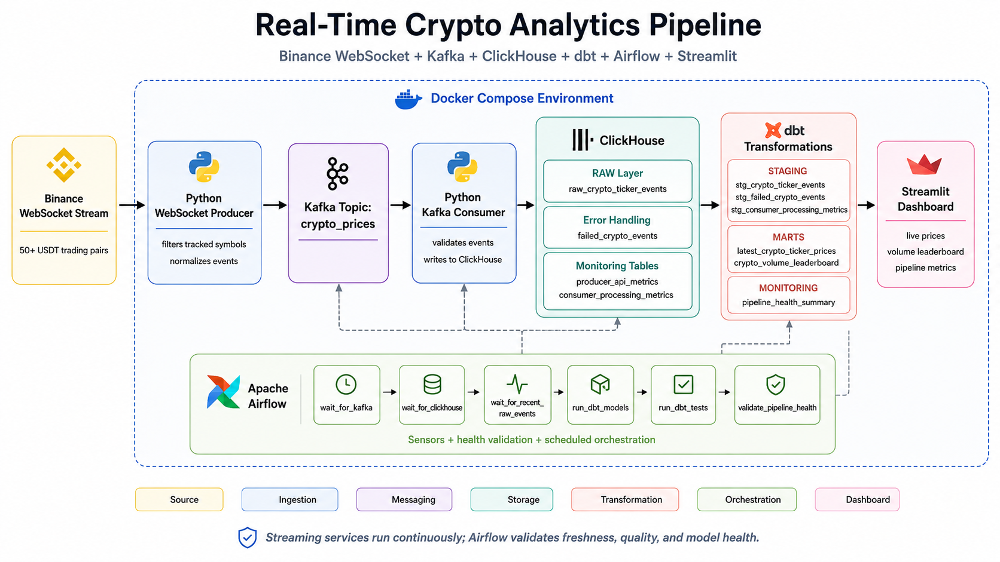
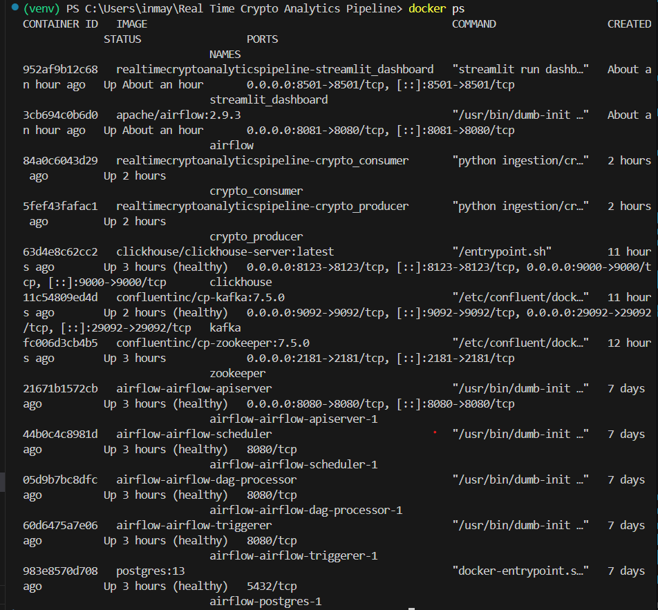
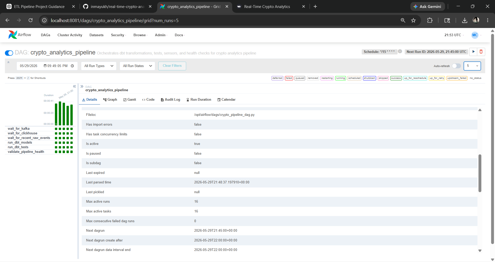
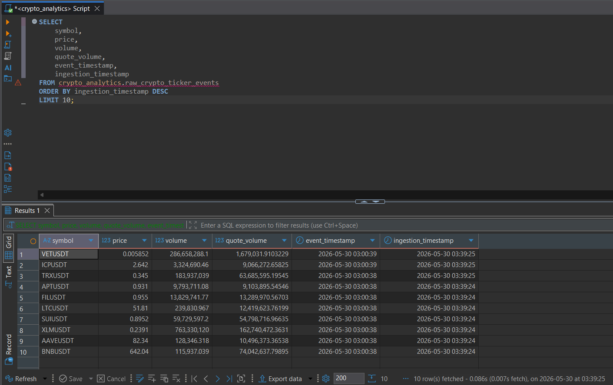
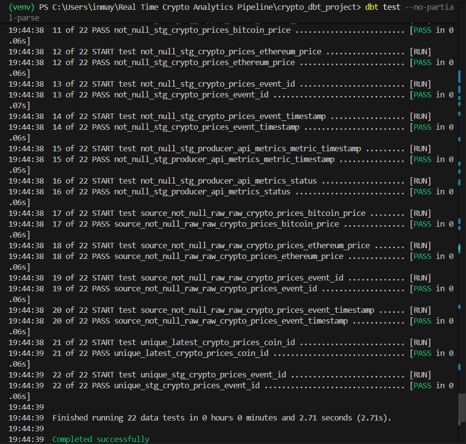
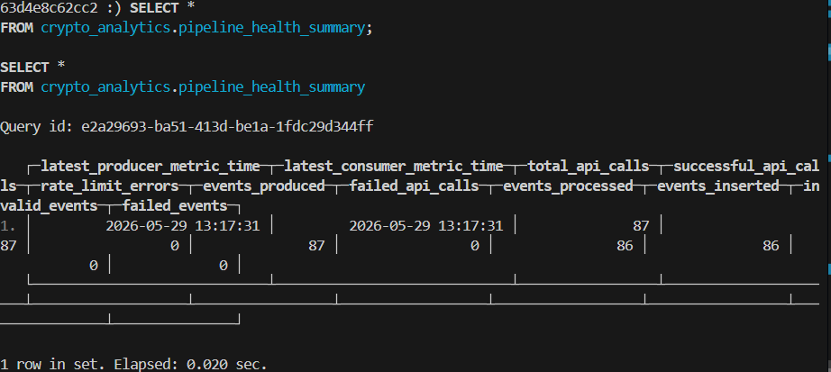
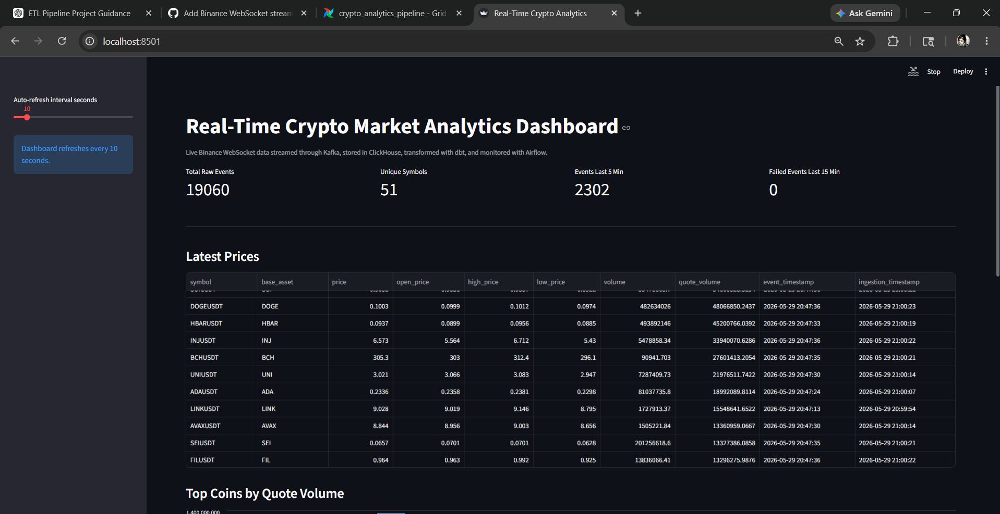
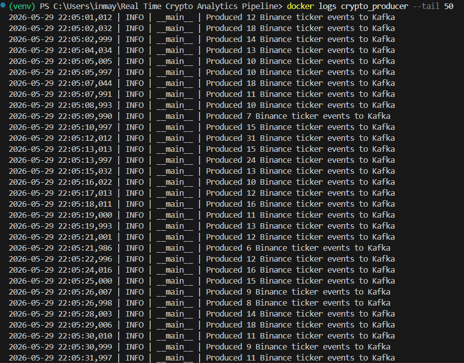
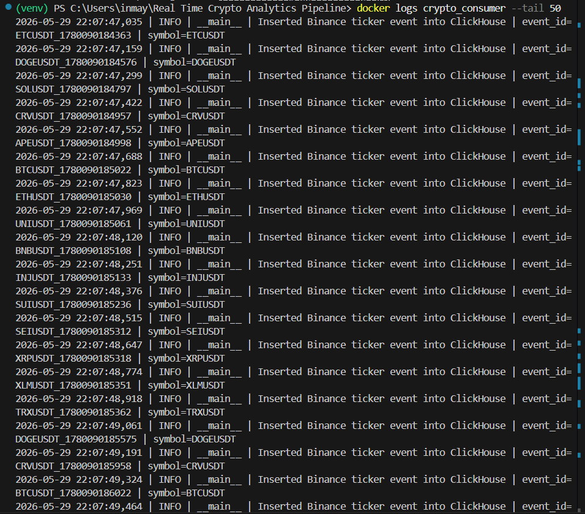

# Real-Time Crypto Market Analytics Pipeline



## Project Overview

This project is a Docker-managed real-time data engineering pipeline that ingests live cryptocurrency ticker events from the Binance WebSocket stream, publishes normalized events to Kafka, stores them in ClickHouse, transforms them using dbt, orchestrates analytical checks using Apache Airflow, and visualizes live market and pipeline metrics using Streamlit.

The current version of the project uses a continuous WebSocket stream instead of REST API polling. It tracks 50+ USDT trading pairs and models the data using a normalized event schema so the pipeline can support many symbols without creating wide, hardcoded price columns.

---

## What This Project Demonstrates

This project demonstrates practical data engineering concepts used in real streaming systems:

- WebSocket-based real-time ingestion
- Kafka producer and consumer patterns
- Normalized event schema design for multi-asset data
- ClickHouse analytical storage
- RAW, STAGING, and MART data layers
- dbt incremental transformations
- Replay-safe deduplication
- CDC-style latest-state modeling
- Airflow sensors and pipeline health validation
- Streamlit dashboarding
- Failed-event handling
- Docker Compose infrastructure
- Persistent volumes
- Health checks
- Environment-based configuration
- Structured Python logging

---

## Tech Stack

| Layer | Technology |
|---|---|
| Streaming source | Binance WebSocket |
| Messaging / streaming | Apache Kafka |
| Producer | Python WebSocket producer |
| Consumer | Python Kafka consumer |
| Analytical database | ClickHouse |
| Transformation | dbt |
| Orchestration | Apache Airflow |
| Dashboard | Streamlit |
| Infrastructure | Docker Compose |
| Configuration | `.env` |
| Monitoring | Airflow health checks, ClickHouse monitoring tables, Streamlit metrics |

---

## High-Level Architecture

```text
Binance WebSocket Stream
        ↓
Python WebSocket Producer
        ↓
Kafka Topic: crypto_prices
        ↓
Python Kafka Consumer
        ↓
ClickHouse RAW Layer
        ↓
dbt STAGING Layer
        ↓
dbt MART Layer
        ↓
Streamlit Dashboard
```

Airflow runs the analytical workflow around the streaming pipeline:

```text
wait_for_kafka
        ↓
wait_for_clickhouse
        ↓
wait_for_recent_raw_events
        ↓
run_dbt_models
        ↓
run_dbt_tests
        ↓
validate_pipeline_health
```

The producer and consumer are long-running Docker services. Airflow does not run them directly. Instead, Airflow validates that the streaming system is healthy, fresh data is arriving, dbt models are updated, and tests are passing.

---

## Project Folder Structure

```text
Real Time Crypto Analytics Pipeline
│
├── airflow/
│   └── dags/
│       └── crypto_pipeline_dag.py
│
├── architecture/
│   ├── architecture.svg
│   └── project_architecture.md
│
├── clickhouse/
│   └── init/
│       └── init_tables.sql
│
├── crypto_dbt_project/
│   ├── models/
│   │   ├── staging/
│   │   │   └── stg_crypto_ticker_events.sql
│   │   ├── marts/
│   │   │   ├── latest_crypto_ticker_prices.sql
│   │   │   └── crypto_volume_leaderboard.sql
│   │   └── monitoring/
│   ├── profiles/
│   └── dbt_project.yml
│
├── dashboard/
│   └── app.py
│
├── ingestion/
│   ├── crypto_producer.py
│   └── crypto_consumer.py
│
├── screenshots/
│
├── Dockerfile
├── docker-compose.yml
├── requirements.txt
├── .env.example
├── .gitignore
└── README.md
```

---

## Data Flow

### 1. Binance WebSocket Ingestion

The producer connects to the Binance mini ticker WebSocket stream:

```text
wss://stream.binance.com:9443/ws/!miniTicker@arr
```

It receives continuous ticker updates, filters the stream to the tracked USDT pairs, converts each ticker update into a normalized event, and publishes each event to Kafka.

Example event structure:

```json
{
  "event_id": "BTCUSDT_1780000000000",
  "event_timestamp": "2026-05-29T20:30:00.000000",
  "source": "binance_websocket",
  "symbol": "BTCUSDT",
  "base_asset": "BTC",
  "quote_asset": "USDT",
  "price": 104000.12,
  "open_price": 103500.00,
  "high_price": 105000.00,
  "low_price": 102900.00,
  "volume": 12345.67,
  "quote_volume": 123456789.12
}
```

---

### 2. Kafka Streaming

Kafka decouples ingestion from downstream processing.

The topic used is:

```text
crypto_prices
```

The topic is created automatically by the `kafka_init` service in Docker Compose.

---

### 3. Consumer Processing

The Kafka consumer reads ticker events from the `crypto_prices` topic, validates each event, and inserts valid rows into ClickHouse.

Valid events go to:

```text
raw_crypto_ticker_events
```

Invalid or malformed events go to:

```text
failed_crypto_events
```

The consumer also records processing metrics in:

```text
consumer_processing_metrics
```

---

### 4. ClickHouse RAW Layer

The RAW layer stores normalized ticker events.

Main RAW table:

```text
raw_crypto_ticker_events
```

The table is append-oriented and supports replay, auditability, debugging, and incremental processing.

Key columns:

```text
event_id
event_timestamp
ingestion_timestamp
source
symbol
base_asset
quote_asset
price
open_price
high_price
low_price
volume
quote_volume
```

---

### 5. dbt STAGING Layer

The staging model cleans and deduplicates raw ticker events.

Main staging model:

```text
stg_crypto_ticker_events
```

It performs:

- event-level deduplication
- price validation
- symbol normalization
- incremental processing
- replay-safe transformation logic

---

### 6. dbt MART Layer

The mart layer creates analytics-ready tables.

Main mart models:

```text
latest_crypto_ticker_prices
crypto_volume_leaderboard
```

These models support:

- latest price lookup per symbol
- top symbols by quote volume
- live market monitoring
- dashboard reporting

---

### 7. Airflow Orchestration and Health Validation

Airflow is used to orchestrate analytical validation around the streaming system.

The DAG includes:

```text
wait_for_kafka
wait_for_clickhouse
wait_for_recent_raw_events
run_dbt_models
run_dbt_tests
validate_pipeline_health
```

This means Airflow is responsible for:

- checking Kafka availability
- checking ClickHouse availability
- checking whether fresh raw events are arriving
- running dbt transformations
- running dbt tests
- validating pipeline health
- triggering failure callbacks when freshness or health checks fail

This is different from using Airflow to run the streaming producer and consumer directly. The producer and consumer are long-running services managed by Docker.

---

### 8. Streamlit Dashboard

The Streamlit dashboard connects to ClickHouse and displays:

- latest prices
- top symbols by quote volume
- rolling price trend for selected symbol
- total raw event count
- unique symbol count
- recent event count
- recent failed event count
- pipeline health summary

Dashboard URL:

```text
http://localhost:8501
```

---

## Key Features

- Binance WebSocket streaming ingestion
- 50+ tracked crypto symbols
- Kafka producer and consumer architecture
- Dockerized streaming services
- Normalized ticker-event schema
- ClickHouse analytical warehouse
- RAW, STAGING, and MART layers
- dbt incremental transformations
- Replay-safe deduplication
- CDC-style latest-state mart
- Volume leaderboard mart
- Airflow sensors for Kafka, ClickHouse, and fresh raw data
- Airflow pipeline health validation task
- Airflow failure callback pattern
- dbt tests
- Streamlit dashboard
- Consumer processing metrics
- Failed-event logging
- Kafka topic auto-creation
- Docker health checks
- Persistent ClickHouse and Airflow volumes
- `.env`-based configuration
- Structured Python logging
- Retry handling for service readiness

---

## Setup Instructions

### Prerequisites

Install:

- Docker Desktop
- Git
- Python 3.11+
- VS Code or another editor

---

## Environment Variables

Create a `.env` file in the project root using `.env.example`.

Example:

```env
CLICKHOUSE_DB=crypto_analytics
CLICKHOUSE_USER=admin
CLICKHOUSE_PASSWORD=admin123

AIRFLOW_USER=airflow
AIRFLOW_PASSWORD=airflow
```

Do not commit `.env` to GitHub.

---

## Run the Project

From the project root:

```powershell
docker compose up -d --build
```

This starts:

- Zookeeper
- Kafka
- Kafka topic initialization service
- ClickHouse
- Airflow
- Crypto WebSocket producer
- Crypto Kafka consumer
- Streamlit dashboard

---

## Verify Running Containers

```powershell
docker compose ps
```

Expected services:

```text
zookeeper
kafka
clickhouse
airflow
crypto_producer
crypto_consumer
streamlit_dashboard
```

The `kafka_init` container may exit after successfully creating the Kafka topic.

---

## Verify Kafka Topic

```powershell
docker exec -it kafka kafka-topics --bootstrap-server kafka:9092 --list
```

Expected topic:

```text
crypto_prices
```

---

## Verify Producer

```powershell
docker logs crypto_producer --tail 50
```

Expected log pattern:

```text
Produced X Binance ticker events to Kafka
```

---

## Verify Consumer

```powershell
docker logs crypto_consumer --tail 50
```

Expected log pattern:

```text
Inserted Binance ticker event into ClickHouse
```

---

## Access ClickHouse

```powershell
docker exec -it clickhouse clickhouse-client --user admin --password admin123
```

Check raw ticker event count:

```sql
SELECT count(*)
FROM crypto_analytics.raw_crypto_ticker_events;
```

View latest raw ticker events:

```sql
SELECT
    symbol,
    price,
    volume,
    quote_volume,
    event_timestamp,
    ingestion_timestamp
FROM crypto_analytics.raw_crypto_ticker_events
ORDER BY ingestion_timestamp DESC
LIMIT 10;
```

Check symbol coverage:

```sql
SELECT
    countDistinct(symbol) AS unique_symbols,
    count(*) AS total_events
FROM crypto_analytics.raw_crypto_ticker_events;
```

---

## Access Airflow

Open:

```text
http://localhost:8081
```

Credentials:

```text
Username: airflow
Password: airflow
```

Trigger the DAG:

```text
crypto_analytics_pipeline
```

The DAG should show these tasks:

```text
wait_for_kafka
wait_for_clickhouse
wait_for_recent_raw_events
run_dbt_models
run_dbt_tests
validate_pipeline_health
```

---

## Access Streamlit Dashboard

Open:

```text
http://localhost:8501
```

The dashboard shows live prices, volume rankings, rolling trends, recent event counts, failed event counts, and pipeline health.

---

## dbt Models

### Sources

```text
raw_crypto_ticker_events
failed_crypto_events
consumer_processing_metrics
```

### Staging Models

```text
stg_crypto_ticker_events
stg_consumer_processing_metrics
stg_failed_crypto_events
```

### Mart and Monitoring Models

```text
latest_crypto_ticker_prices
crypto_volume_leaderboard
pipeline_health_summary
```

---

## Running dbt Manually

For local Windows terminal execution, use the local dbt profile with:

```text
host: localhost
```

Run:

```powershell
cd crypto_dbt_project
dbt run --no-partial-parse
dbt test --no-partial-parse
```

Inside Airflow/Docker, the dbt profile uses:

```text
host: clickhouse
```

---

## Important Queries

### Latest Raw Ticker Events

```sql
SELECT *
FROM crypto_analytics.raw_crypto_ticker_events
ORDER BY ingestion_timestamp DESC
LIMIT 10;
```

### Latest Crypto Ticker Prices

```sql
SELECT *
FROM crypto_analytics.latest_crypto_ticker_prices
ORDER BY quote_volume DESC
LIMIT 20;
```

### Crypto Volume Leaderboard

```sql
SELECT *
FROM crypto_analytics.crypto_volume_leaderboard
ORDER BY quote_volume DESC
LIMIT 20;
```

### Consumer Monitoring

```sql
SELECT *
FROM crypto_analytics.consumer_processing_metrics
ORDER BY metric_timestamp DESC
LIMIT 10;
```

### Failed Events

```sql
SELECT *
FROM crypto_analytics.failed_crypto_events
ORDER BY failed_at DESC
LIMIT 10;
```

### Pipeline Health Summary

```sql
SELECT *
FROM crypto_analytics.pipeline_health_summary;
```

---

## Screenshots

### Docker Containers Running



---

### Airflow DAG Success



---

### ClickHouse RAW Events



---

### dbt Test Success



---

### Pipeline Health Summary



---

### Streamlit Dashboard



---

## Production Engineering Concepts Demonstrated

This project demonstrates:

- WebSocket streaming ingestion
- event-driven architecture
- Kafka producer and consumer patterns
- normalized event schema design
- consumer groups and offsets
- at-least-once delivery behavior
- duplicate handling
- replay-safe transformations
- idempotent processing design
- RAW, STAGING, and MART layering
- dbt incremental modeling
- CDC-style latest-state modeling
- Airflow orchestration
- Airflow sensors
- freshness validation
- pipeline health validation
- data quality testing
- failed-event capture
- observability tables
- Streamlit dashboarding
- Dockerized services
- persistent volumes
- health checks
- environment-based configuration
- structured logging
- startup retry handling

---

## Screenshots

### 1. Docker Services Running

Shows that Kafka, ClickHouse, Airflow, producer, consumer, and Streamlit are running.


---

### 2. Binance WebSocket Producer Logs

Shows that the producer is continuously receiving Binance WebSocket ticker updates and publishing events to Kafka.



---

### 3. Kafka Consumer Logs

Shows that the consumer is reading ticker events from Kafka and inserting them into ClickHouse.



---

### 4. ClickHouse RAW Ticker Events

Shows normalized ticker events stored in the ClickHouse RAW table.


---

### 5. dbt Test Success

Shows that dbt data quality tests passed successfully.


---

### 6. Airflow DAG Success

Shows Airflow running sensors, dbt models, dbt tests, and pipeline health validation successfully.


---

### 7. Streamlit Dashboard

Shows live prices, volume leaderboard, rolling trends, and pipeline health metrics.


## 🚀 Live Deployment
Deployed on AWS EC2 (t3.small) with Docker Compose.

**Live Dashboard:** http://13.207.41.151:8501

> Instance may be stopped to manage costs. DM me to spin it up for a live demo.

### Retention Policy
| Layer | Retention |
|---|---|
| RAW | 1 day |
| STAGING | 3 days |
| Monitoring | 3 days |
| MART | No TTL (current state only) |

---

## Known Limitations

- Binance WebSocket data depends on external stream availability.
- Airflow uses containerized local metadata persistence instead of an external PostgreSQL metadata database.
- Alerting currently uses an Airflow failure callback pattern rather than real Slack/email integration.
- No schema registry is used for Kafka event contracts.
- No Kafka dead-letter topic is implemented yet.

---

## Future Improvements

- Add PostgreSQL as the Airflow metadata database.
- Add Slack or email alerts for Airflow failures.
- Add Grafana or Superset alongside Streamlit.
- Add schema validation contracts for incoming Kafka events.
- Add CI/CD checks for dbt models.
- Add Great Expectations or advanced dbt tests.
- Add Kafka dead-letter topic support.
- Add a real CDC pipeline using PostgreSQL + Debezium + Kafka.

---

## ✅ Recent Updates
* Deployed to AWS EC2 (t3.small) — live dashboard at http://13.207.41.151:8501
* Implemented tiered ClickHouse retention policy (RAW: 1 day, STAGING: 3 days)
* Removed obsolete REST API producer metrics from pipeline health dashboard
* Automated dbt runs every 5 minutes via cron job on EC2

---

## Interview Summary

This project is a real-time data engineering pipeline that ingests live crypto market ticker data from Binance WebSocket streams for 50+ symbols, publishes events to Kafka, stores normalized ticker events in ClickHouse, transforms the data using dbt, orchestrates freshness checks and dbt workflows through Airflow, and visualizes live analytics through a Streamlit dashboard.

It demonstrates practical data engineering concepts including WebSocket streaming ingestion, Kafka event processing, event validation, replay-safe deduplication, incremental dbt models, CDC-style latest-state modeling, observability, failed-event handling, Airflow sensors, health validation, Dockerized infrastructure, and production-style orchestration.

---

## Author

Mayukh Chowdhury
